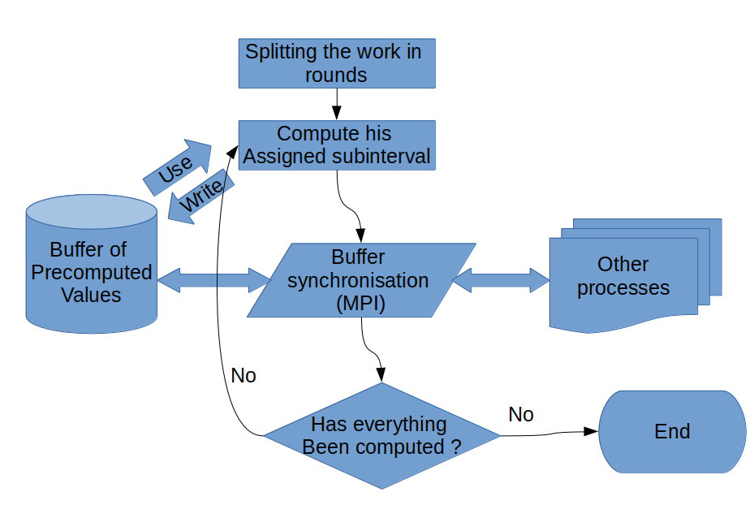
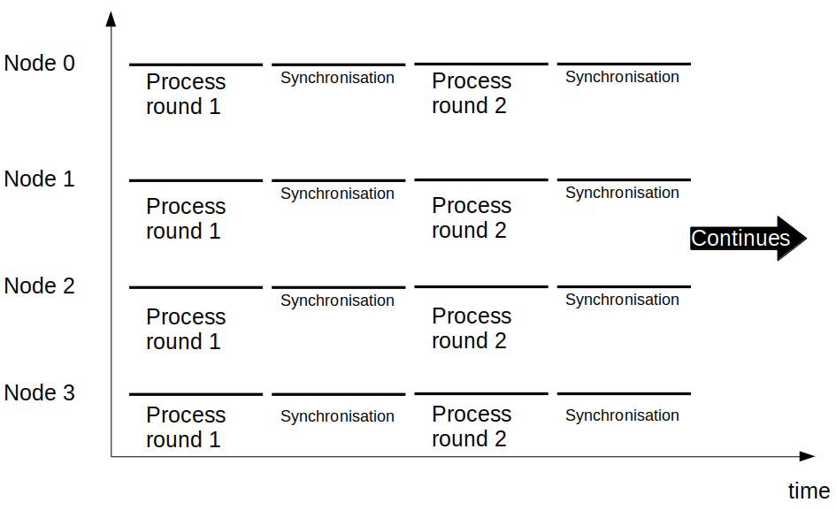
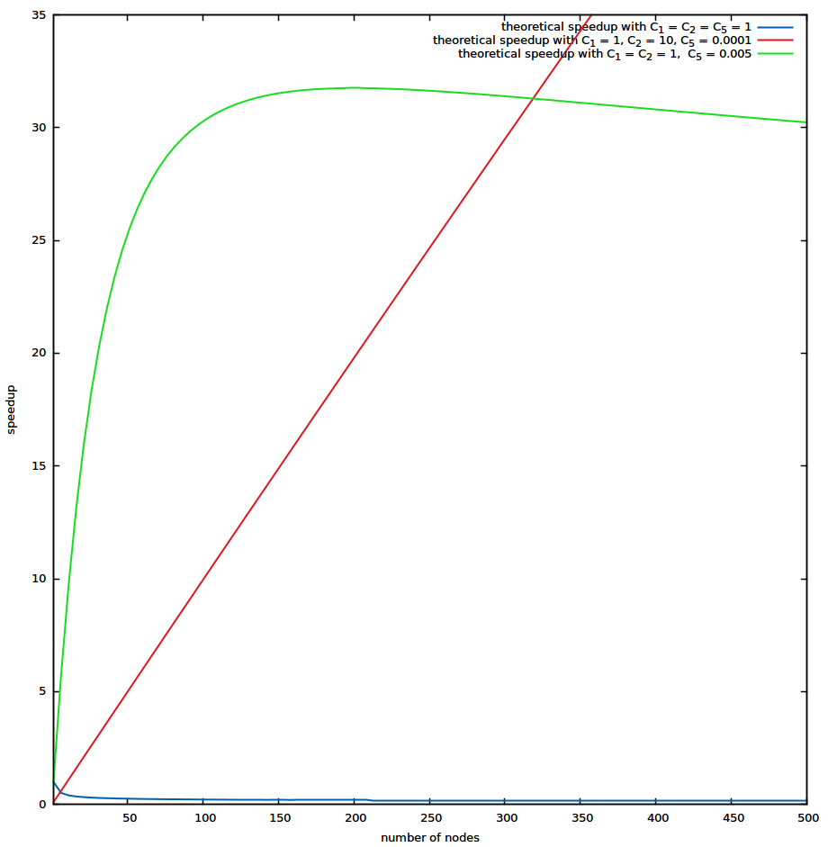
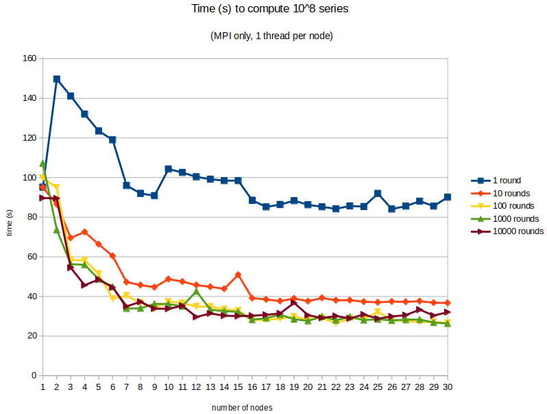
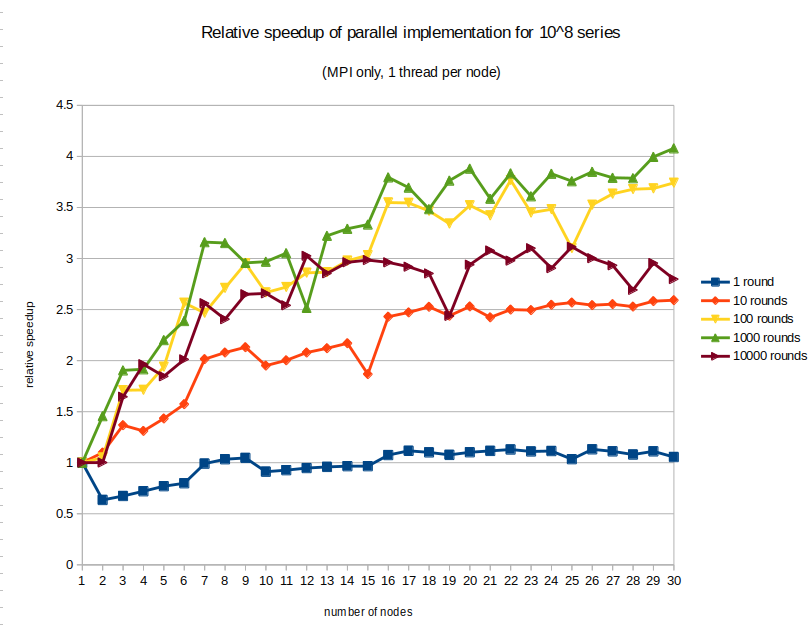

The problem
===========

In this chapter we will explain the problem we are trying to solve.

The Syracuse recurrence
-----------------------

Before we can define the problem we are facing we need to define some mathematical vocabulary.

The Syracuse recurrence is a recurrence relation on positive integers. It is defined this way :

$$
  R(x)=\left\{
    \begin{array}{ll}
      \frac{n}{2} & \text{if n is even} \\
      3n + 1  & \text{if n is odd}
    \end{array}
  \right.
$$

The Syracuse series
-------------------

Now that we have defined the Syracuse recurrence we can define a Syracuse serie. There are as many series as positive integers. We can define the $k^{th}$ Syracuse serie this way: 

$$
S_k(n) =\left\{
    \begin{array}{ll}
      k & \text{if } n = 0 \\
      R\left(S_k(n-1)\right) & \text{otherwise}
    \end{array}
  \right.
$$

### Examples

- The $4^{th}$ serie: 4, 2, 1, 4, 2, 1, ...
- The $7^{th}$ serie: 7, 22, 11, 34, 17, 52, 26, 13, 40, 20, 10, 5, 16, 8, 4, 2, 1, ...
- the $8^{th}$ serie: 8, 4, 2, 1, 4, 2, 1, ...


The Collatz/Syracuse conjecture
-------------------------------

As you might already have noticed, the series are infinite and more interesting it seems they always eventually reach 1. We can now define the Collatz conjecture in different ways (they are both equivalent): 

- Every Syracuse serie eventually reach 1
- Every Syracuse serie only contain the trivial cycle (1, 4, 2)

There are other ways to define this conjecture but we will not use them so it was not useful to include them in this document.

The aim of the project
----------------------

The aim of this project is to check that the Collatz conjecture is true for as many series as possible (starting at 2). We will try to find an efficient algorithm and make it parallel in order to be able to run it on the EPFL deneb cluster.

Algorithms and strategies
=========================

Naive algorithm
---------------

### Sequential implementation

This is the naive sequencial algorithm:

```javascript
for(i = 2; i < T; i++) {
  j = i
  l = 0; //the length of the serie
  while (j != 1) {
    if (j%2 == 0) {
      j = j/2
    } else {
      j = 3*j + 1
    }
    l++;
  }
}
```

If this piece of code does stop. Then the Collatz conjecture is verified for all Syracuses series up to $T$.In Any real world application we would like to add a cycle detection algorithm but here we are more intereseted in the parallelisation of this algorithm.


#### Complexity analysis

Before we can do a proper analysis, we need to do some empirical tests. Indeed, for each starting point, we don't know in advance how many iterations of the Syracuse recurrence it will take before we reach 1. So we cannot really determine the complexity of the algorithm in advance. For this analysis we will use the naive sequential approach to determine the number of steps. For example to reach 1 starting from 3 it take 7 steps to reach 1 : 

```
3 -> 10 -> 5 -> 16 -> 8 -> 4 -> 2 -> 1
```
Using the very naive approach we compute the average number of iterations to reach 1 for each starting point from 2 to T. We did it for each $T \in \{10^x | x \in [1;8]\}$. Let's note $f(x)$ the average number of steps per integer to compute from $2$ to $10^x$. For example $f(1) = 7.44$ because as you can see in the example we gave before, the average of the values is $7.44$. Here are the values we found for $f(1)$ to $f(8)$ (It takes too much time on a single machine to compute more).

```
7.4444444444444
31.737373737374
59.601601601602
84.975097509751
107.53947539475
131.43455543456
155.27249862725
179.23493762235

```

As you might remark, the values are almost perfectly linear. It was not expected but it will be very convenient for our analysis. As we are in exponential scale, we can deduce that the number of steps for each starting point is logarithmic. To be more precise here is the approximate formula : $$ f(x) \simeq 7.44 + 24.6(x - 1)$$

We now have the number of steps of the naive algorithm : $$ T\times f(\log_{10}(T)) = \mathcal{O}(T\log(T))$$

### Parallel implementation

As you can see there are no dependencies between all instances of the for loop. This means this algorithm can be parallelized by spreading all i's among nodes. We can expect a prefect linear speedup. But only if we spread the i's randomly because there are some series more expensive than the others. Parallelizing this algorithm is so simple it's not worth it to detail it here.

The heuristic
-------------

### Description of the heuristic

A simple (yet powerfull) heuristic for this problem is to apply a time-memory tradeof. We can save for each starting point we already computed the number of iterations before reaching 1. 

For example we compute the number of steps to go from 5 to 1 it take 5 steps, we memorize it. When we want to compute starting at 10. We apply the recurence once and we find 5 (because $10/2 = 5$) we can deduce that the number of steps from 10 to 1 is $1 + 5 = 6$. And it took only 2 iterations instead of 6 for the naive algorithm.


### Sequential implementation

Here is the algorithm:

```javascript
memory = new Hashmap();
for (i = 2; i < T; i++) {
  j = i
  l = 0 // the length of the serie
  while (j > 1) {
    if (memory[j] != undefined) {
      l = memory[j]
    } else {
      if (j%2 == 0) {
        j = j/2
      } else {
        j = 3*j + 1
      }
      l++;
    }
  }
  memory[i] = l;
}

```

In the practical implementation of this algorithm I used a tail recursive function instead of the while loop in order to save all steps to the `memory` hash map.

#### Complexity analysis

The problem to evaluate this new algorithm is that we cannot predict how many iterations it will take before we reach a value we already know (i.e. already in the hashmap). We can't even predict __if__ we will be using the hashmap for a given serie.

To overcome this we also did an empirical approach to estimate this value. We note $g(x)$ the number of __iterations__ it took with this new algorithm. $x$ goes also from $1$ to $8$. 

```
4
9.1010101010101
6.3833833833834
6.1842184218422
6.2091520915209
6.2262642262642
6.2359355235936
6.2389850023899
```

As we can see it seems that the values of $g(x)$ are converging to a value near $6.24$. This is great because we can assume that with this algorithm the amortized complexity for each integer is constant. We now have the complexity for the new algorithm: $$ T\times g(log_{10}(T)) = \mathcal{O}(T)$$

### Parallel implementation

Here is the strategy we will be using to parallelize this algorithm: We will divide T (the number of series we want to test) into N equal rounds. We will also divide each round among all nodes. Each round will consist in two stages: 

1. __Computation stage__: each node compute its sub-interval of T (and uses his precomputed values table which is initially empty)
2. __Sharing stage__: nodes share their new precomputed values between each others (only the ones they learnt during the last computation stage.

The algorithm is described visually in the figure \ref{parallel-algorithm-schema}.




Theoretical Analysis
====================

The naive algorithm is very easy to parallelize because there is no shared state between the iteration. On the other side, in the improved algorithm we memorize the previous values. The problem is that nodes cannot share all their memory. If we distribute the algorithm, at some point precomputed values will not be available when needed. We had to evaluate the how the algorithm behaves when only part of memorized values are available. 

Here are the number of __iterations__ needed to compute the values from $10^1$ to $10^8$ if only 50% of the precomputed values are available

```
7.6666666666667
11.058823529412
7.7884231536926
8.0161967606479
8.1495170096598
8.1739256521487
8.1845663630867
8.1816952563661
```

And here are the result if only 1% of the values are available:

```
7.4444444444444
31.737373737374
54.368314833502
40.619634380366
41.315612973606
41.427014720187
42.121434533188
42.143153897544
```

As the experiment shows, it seems that the value is still constant. This is great for us because it means we still have a linear algorithm even if all the memory is not shared between nodes.

Now we know that the overall complexity stays linear even if we don't have all precomputed values we can do a proper analysis.

Upper bound speedup
-------------------

If we choose to have only one round of computation there is no communication between nodes. Moreover there are no initialization phase. That means, thanks to Amdahl's law, we can reach an infinite speedup with an infinite number of nodes. The problem is if we have only one round (no sharing) the algorithm is very slow, so even if we can parallelize it on multiple nodes easily it has a very bad efficiency. 

I order to have a better estimation we will need a detailed speedup formula.

Detailed analysis
-----------------

### Timing Diagram


The critical path is always a straight line on the node that has the longest last processing round. This comes from the fact that there is no master node. In our model we assume all processing round take the same amount of time. With this assumption all paths are critical paths.

### Theoretical analysis


Let's define the 3 parameters of our model:

$$ 
\begin{aligned}
&N : \text {The number of computation nodes} \\
& M : \text {The number of rounds} \\
&T : \text {The target (The number of series we want to compute)} 
\end{aligned}
$$

We will cut the interval we want to compute into $M \times N$ sub-intervals named $\tau_1$ to $\tau_{M\times N}$. In our model, we will assume the the work associated to a sub-intervals do not deviate too much from the average case. We will note $t = \frac{T}{N \times M}$ the number of series to compute in a given sub-interval.

In round $r$ each node (of id $n$),  we compute $\tau_{n + r\times N}$. And between each computation round, each node broadcast the new values he found so the others can use it in order to shorten their computation time.

As we can see on the timing diagram, the critical path is clearly a straight line on node 1.

We will now try to estimate the speedup using this model. The time to solve the problem with the optimized sequential algorithm is $W_{seq} = C_1 \times T$ for some $C_1$

The time to solve a sub-interval(red block in the timing diagram) assuming we have enough precomputed values available is $W_{si} = C_2 \times t$. In average we have $C_2 > C_1$.

In the communication part, each node has to send the new values it precomputed during the previous round to all other nodes. We know we can't have more new values than the number of the iterations of the algorithm. QWe know each broadcast can be done in $C_3 \times \log(N) \times t$ for some $C_3$. We need to do this for each node so the communication part can be done in $W_{com} = C_3 \times N \log(N)\times t$.

In the last part (yellow in the timing diagram), each node has to send his results. But it does not need to send it all because most of it was already sent during the previous communication rounds. It only has to send exactly $t$ values. It can be done in time $C_4\times t$ for some $C_4$. The whole merging phase can be done in $W_{merge} = C_4Nt$.

We can now compute the length of the critical path ($W_{cp}$).

$$ 
\begin{aligned}
W_{cp} &= M\times W_{si} + (M-1)W_{com} + W_{merge} \\
&= MC_2t + (M-1)tN\log(N)C_3 + NtC_4 \\
&= MC_2\frac{T}{NM} + (M-1)\frac{T}{NM}N\log(N)C_3 + N\frac{T}{NM}C_4 \\
&= \frac{C_2T}{N} + (M-1)\frac{T}{M}\log(N)C_3 + \frac{T}{M}C_4 \\
\end{aligned}
$$
To simplifiy our understanding, instead of computing $W_{cp}$ we will compute an upper bound for it. Let's consider $C_5 = \max(C_3, C_4)$
$$ 
\begin{aligned}
W_{cp} &< \frac{C_2T}{N} + \frac{T}{M}\left((M-1)\log(N)C_5 + C_5 \right)\\
&< \frac{C_2T}{N} + \frac{T}{M}\left((M-1)\log(N)C_5 + C_5\log(N) \right) \text{because } N \geq 1\\
&= \frac{C_2T}{N} + \frac{T}{M}M\log(N)C_5 \\
&= \frac{C_2T}{N} + T\log(N)C_5 \\
&= T\left(\frac{C_2}{N} + \log(N)C_5\right) \\
\end{aligned}
$$

Let's compute the speedup: 

$$ 
\begin{aligned}
S_p &= \frac{W_{seq}}{W_{cp}} \\
&> \frac{TC_1}{T\left(\frac{C_2}{N} + \log(N)C_5\right)} \\
&= \frac{C_1}{\frac{C_2}{N} + \log(N)C_5} \\
&= \frac{NC_1}{C_2 + N\log(N)C_5} \\
\end{aligned}
$$

As we can see, the limit of our speedup when N reach $\infty$ is 0. But for some values of the constant we can get a positive speedup for some values of N. We can split our analysis into 3 cases.

- $C_5 \sim C_2$: The speedup is always decreasing, and less than 1.
- $C_5 < C_2$: The speedup grows until it reach a global maximum and the decrease to 0.
- $C_5 \ll C_2$: The speedup is almost linear and the slope of the line is $C_1/C_2$

You can see the 3 cases on Figure \ref{theoretical-chart}



## Estimating the values of the constants

In order to predict if there will be a speedup in real life we need to have an rough idea of $C_1$, $C_2$ and $C_5$.  
From experiments on the sequential program  we found that $C_1 \simeq C_2 \simeq 3\times 10^{-8}$

If we suppose we have an Intel 40Gb/s QDR IB network, according to the mellanox website we would have a throughput of 3.2GB/s. $C_5$ roughly represent the time required to send an integer. Our integers are encoded with 32bits. We can estimate $C_5 \sim \frac{32}{3.2\times 2^{30}} = 9.3 \times 10^{-9}$

With this constants the best speedup we could achieve is $1.5$ with $3$ nodes.

Results
=======

Impact of the number of rounds
------------------------------






As we can see on figures \ref{time-1tpn-mpi} and \ref{speedup-1tpn-mpi} 

