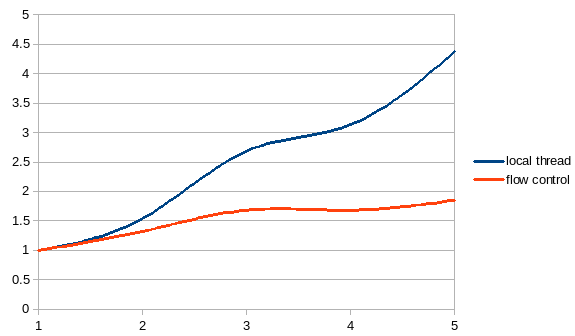
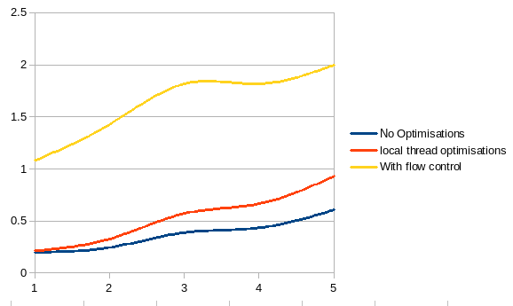

Report for Lab 3
================

Guillaume Leclerc, 224338

## Experiment 1

### Question 1

A. It took 4 seconds to find an optimal solution. 
B. The total time is 8 seconds
C. In average it will take more time but with luck it might take less time because we could find a very good solution at the begining then a lot of the branches in the graph would be cut.

## Experiment 2

### Question 2

A.  In the split operation we stop the recursion when the length of the path is 3 insted of being the number of cities. And when we stop the recursion instead of computing the total length we post the PathData to slaves
B.  If we want to change the number of messages sent by the Split operation we can change the length of path sent. For example if we send messages with paths of length 1 we will end up with n messages (where n is the number of cities). It is impossible to get the exact number of messages that will be sent because we are ignoring some path that are known to be not optimals. But we can give an upper bound (the case when no path are ignored). In this case the number of messages sent is `n!/(n-l)` where `n` is the number of cities and `l` is the length of the path we send.
C.  The solve function has not been modified in the process operation. We have to add an `addRef` statement because we are posting the same object we are receiving. Without this `addRef` the object we are sending would be destroyed at the end of `execute`
D. 
	-  __Split__: Input = (pos, path), Output = (best, path, pathLength, bestLength) 
	-  __Process__: Input = (pos, path, bestLength, pathLength), Output = (bestLength, best)
	-  __Merge__: Input = (bestLength, best), Output = (bestLength, best) 

## Experiment 3

### Question 3

A.  The chart is on Figure 1. 
	-  Optimisation 1 (local thread variable): This optimisation consists in having a local variable for each thread containing the minimal length and do branch pruning according to this value. This is a great idea because now each thread is able to prune all the branches that are are known (to him) to be sub-optmial.
	-  Optimisation 2 (shared variale and flow control) : This Optimisation consists in having a shared variable between the split and merge operation and limiting the number of messages sent to the slaves. Moreover when we send a new PathData we send it with they latest optimal value. Allowing the slave do to branch pruning. This is a good idea because it allow more branch pruning but it adds a new limitation because the split and post must be on the same hos.
B.  The chart is on Figure 2. The most efficient solution is the number 2 because the current best solution is shared to all compute nodes.

## Data

- With no optimisations (8 threads per machine)
	-  __1__ : 20.0s
	-  __2__ : 16.3s
	-  __3__ : 10.3
	-  __4__ : 9.2s
	-  __5__ : 6.6s

- With local thread optimization (8 threads per machine)
	-  __1__ : 18.8s
	-  __2__ : 12.2s
	-  __3__ : 7.0s
	-  __4__ : 6.0s
	-  __5__ : 4.3s

- With flow control and communication between split and merge(8 threads per machine)
	-  __1__ : 3.7s
	-  __2__ : 2.8s
	-  __3__ : 2.2s
	-  __4__ : 2.2s
	-  __5__ : 2.0s
